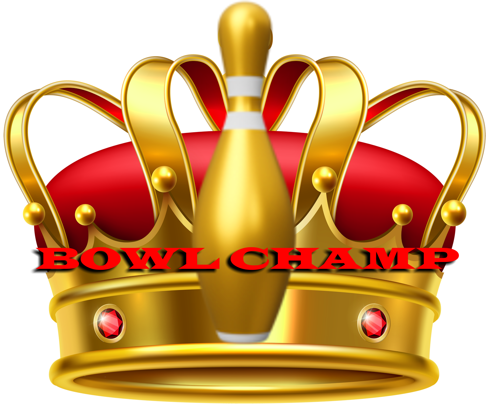
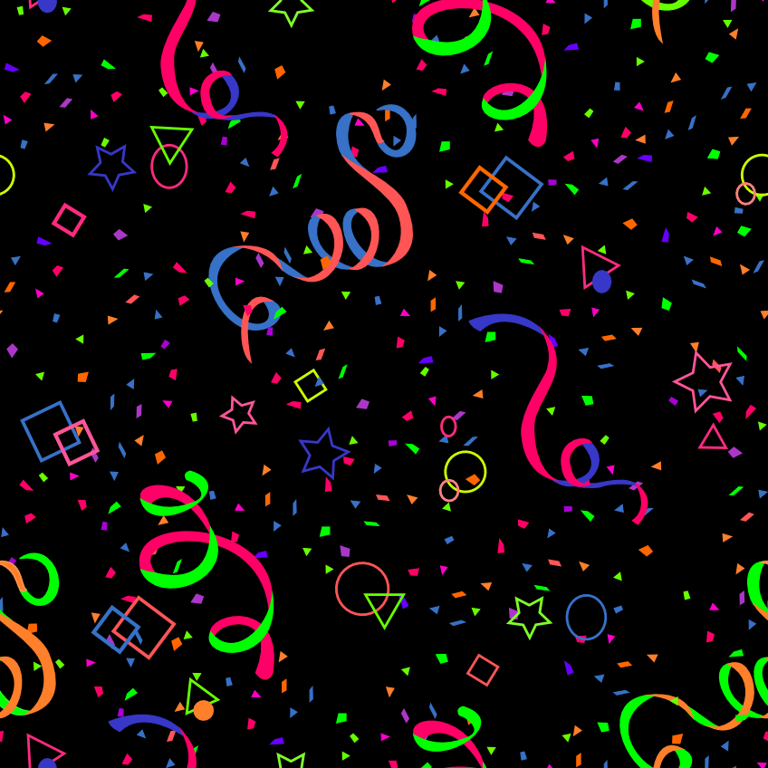
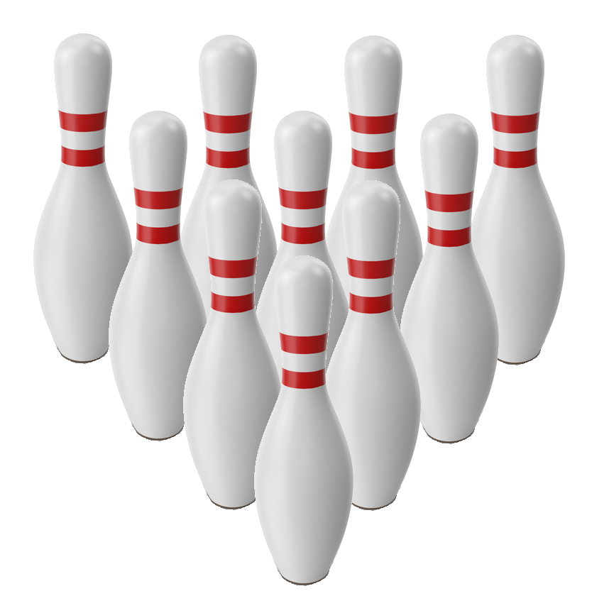
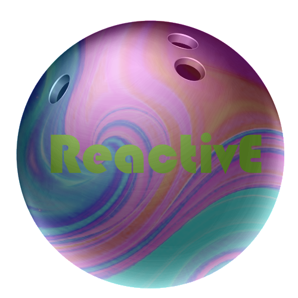
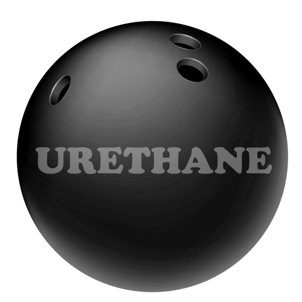
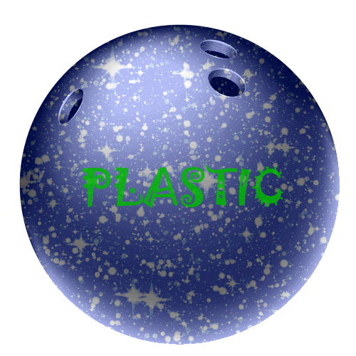

# IT265 Design Treatment Checkpoint

## Change Log
# Initial Concept -> Physical Prototype
- D10 dice to simulate pin knockdowns
- Implemented strategic cards for powerups and different shots
- Established 3 game series to determine champion
- Introduced roll-off tiebreaker mechanic in the event of equal scores after 3 games
# Physical Prototype -> Digital Prototype
- Reduced 3 game format to 1 after digital version seemed slower
- Ditched D10, included click-and-drag feature for more skill-based gameplay
- Enhanced immersion by actually designing bowling balls in Paint.NET rather than cards that describe what the ball does
---

## Title
Bowl Champs

---

## Concept Statement
Bowl Champs is a strategic bowling game combining thoughtful decision-making, and skillful interactive gameplay to determine an ultimate bowling champion.

---

## Genre and Style

### Genre
Strategy, Sports

### Style
A playful, vibrant aesthetic with extremely intuitive gameplay mechanics, integrating real-world bowling ball decisions and semi-immersive graphics.

---

## Target Audience

### Demographics
Ages 10+, casual to moderate competitive gamers, fans of bowling, fans of tabletop strategy games

### Accessibility
Simple and intuitive mechanics, easy visibility

### Inclusivity Strategies
Gender-neutral design and equal playing field and resources for all

---

## Core Gameplay Mechanics

### Primary Mechanics
- Strategic ball choice with different effects, comparable to real-world bowling decisions
- Click-and-drag bowling simulation
- Initially planned for strategic card play for special shots and effects

### Goals and Challenges
The goal is to achieve the highest score by knocking down pins, using skillful ball selection and tactical choices based on opponents.

### Progression
The goal is to gain understanding of best case scenario uses of all bowling balls and shot cards, to increase average score and beat opponents more often over time.

### Game Rules
- Players alternate turns, rolling once per frame with strategic card usage
- Highest score at the end of a full game determines the Bowl Champ
- Ties resolved by sudden-death roll-off

---

## Story and Setting

### Setting
Set in a lively competitive bowling league environment, with (planned) dynamic lane conditions and vibrant neon tournament setting.

### Plot
Players compete to become the ultimate league champion by mastering strategic decisions and bowling skills.

### Characters
Players represent themselves, though I would like to incorporate a character creator, with personalized skill sets and maybe unlockable cosmetic optionns.

---

## Unique Selling Points (USP)
- Strategic card integration with skill-based bowling mechanics
- Interactive bowling simulation
- Competitive and engaging league competition atmosphere

---

## Inspiration

### Sources
- Wii Sports Bowling
- Me bowling for college and in leagues

### Why It Matters
- I wanted to capture the thrill of self-improvement, fierce competition and victory in an easily replayable game that many can enjoy. I think it ends up making the game relatable and uniquely engaging.

---

## Player Experience Goals
The goal is to foster excitement, strategic satisfaction, friendly competition, and accessible fun for anybody that decides to pick the game up.

---

## Technical Requirements

### Platform
Built in HTML for PCs, though could easily be ported to consoles and mobile devices

### Tools
HTML, CSS, JavaScript, and Unity if ever ported in 3D to other platforms

---

## Art and Sound Direction

### Visual Style
I wanted to capture the essence of a real bowling alley, so I used neon colors, retro styles, and even pulled the carpet design from a real bowling alley.

### Sound Design
I used realistic bowling sound effects and crowd sounds to emulate the feeling of being in an alley, and to reinforce good and bad actions with reactions. I also want to add background music in the future to make it more immersive.

---

## Monetization Strategy
The game should be free-to-play, though there could be optional cosmetic DLCs and expansions for new balls or shot cards.

---

## Treatment Details

### Gameplay Example
Players select a strategic card, choose their ball, and click-and-drag to roll. Lane conditions and chosen ball attributes affect pin knockdown. Players accumulate scores over ten frames, with strategic cards influencing outcomes.

---

### Challenges and Considerations

#### Potential Risks
- Balancing card abilities
- Preventing those who mastered the mechanics from being OP
- Keeping multiplayer matches fair and engaging

#### Feasibility
Only risks I can imagine is planning out the game's development with a team that is willing to do it; otherwise everything is super do-able and easy.

---

## Visualizing the Game Concept

### Concept Sketches or Storyboards
- Provide at least **two sketches**  
- Ensure sketches accurately represent the game’s concept and theme  
- Maintain coherence with the game’s style and theme  

The concept is to emulate being in a bowling alley, being within that crowd of people all invested in the game, and being immersed in the thrill of competition, close calls, and a shot at winning big.

---

## Pitch Preparation

### Pitch Summary
"Bowl Champs combines interactive bowling gameplay with strategic card play, delivering a uniquely fun and accessible experience for gamers of all ages."

### Target Audience Appeal
Strategic depth, skill-based mechanics, accessible gameplay catering to casual gamers and bowling enthusiasts alike.

### Market Differentiation
Integrating the use of strategy cards and interactive bowling simulation makes the game unique and distinguishable from comparable purely physics-based or card-based only games.

---

## External Feedback
<!-- Duplicate Feedback group as necessary if beyond 3 -->

### Feedback 1
- **Reviewer**:  
Alex, bowling teammate
- **Summary**:  
  <!-- Summarize feedback focusing on concept, mechanics, and style -->
  Praised the interactive mechanics, though mentioned the mechanics were a bit fantastical
- **Refinement**:  
  <!-- Explain how this feedback will improve the design -->
  Tried to envision more realistic bowling effects, that might be a bit more grounded to reality

### Feedback 2
- **Reviewer**:  
  <!-- Enter name and relation to you -->
  Cole, classmate
- **Summary**:  
  <!-- Summarize feedback focusing on concept, mechanics, and style -->
  Liked the card effects, mentioned there could be more variety as it got predictable
- **Refinement**:  
  <!-- Explain how this feedback will improve the design -->
  Will add more card effects, to make the game more engaging and less monotonous

### Feedback 3
- **Reviewer**:  
  <!-- Enter name and relation to you -->
  Matt Toegel, professor
- **Summary**:  
  <!-- Summarize feedback focusing on concept, mechanics, and style -->
  Mentioned that there should be a degree of skill rather than just rolling dice/pressing button
- **Refinement**:  
  <!-- Explain how this feedback will improve the design -->
  Was the catalyst for the interactive mechanics and click-drag feature

---

## Appendix
<!-- 
Include any additional sketches, mood boards, or early design mockups if available.  
If digital assets are unavailable, describe any rough concepts you have in mind. 
-->

---