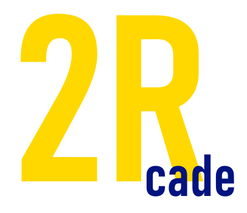

# Game Studio Brainstorming Template

## Studio Name Ideas
- **Primary Ideas:**
  - Rockwell Studios
  - 2RCade
  - Studio2R
- **Alternative Ideas:**
  - 2R Interactive
  - Rockwell Games
  - RDRcade

- **Chosen Name**: 2Rcade
- **About the name**: My Minecraft username is 2_r which is rare and I've had it for a long time while making fond memories playing the game, so it means a lot to me. Then I just slapped the word "arcade" on the end of it.
- **Social Medias with name available**: Instagram, Facebook, Twitter, pretty much all of them
- **Possible domain names available**: 2rcade.com

---

## Vision Statement
*What is the mission of your solo game studio? How does it align with creating and analyzing innovative game architectures?*

> At 2Rcade, we (I) strive to deliver timeless gaming experiences, making easy-to-grasp and replayable games that cater to all audiences. Our (my) mission is to ensure that everybody can pick up a 2Rcade game, enjoy it, and play it again and again with the same excitement had as the first day.

---

## Core Values
*What principles guide your studio's approach to game design, architecture, and development?*

- Value 1: Fun-first Design
- Value 2: Simplicity in Gameplay
- Value 3: Accessibility
- Value 4: Timeless Design

---

## Target Audience
*Who are your games designed for? Identify your primary audience based on your focus on card and board games.*

- **Demographic:** Casual Players, Arcade Game Enthusiasts, Indie Game Fans
- **Interests:** Quick but Engaging Gameplay, Multifaceted Experiences, Multiplayer Fun
- **Platforms:** PC, Web, Mobile

---

## Genre Focus
*What types of games will your studio focus on?*  
*Consider your course's emphasis on depth, mechanics, and balance in card and board games.*

- Arcade, Action, Sports, Simulation
- Rock-inspired, Skate culture, Retro arcade vibes

---

## Unique Selling Point (USP)
*What will make your games stand out from others, particularly in the indie/board game space?*

> 2Rcade focuses on designing games with easily graspable mechanics with multiple layers of interaction. With dynamic player roles and and customizable gameplay options, 2Rcade games will ensure players can discover new strategies and interactions each time they play. This guarantees that games remain engaging even long after the first experience.
---

## Tools and Technology
*What tools and platforms will you use to develop, test, and publish your games?*

- **Game Engine(s):** Unity
- **Art Tools:** paint.net
- **Audio Tools:** Audacity, GarageBand
- **Version Control:** GitHub
- **Publishing Platforms:** Itch.io, GitHub Pages

---

## Branding and Aesthetics
*What will your studio's visual identity look like?*

- **Logo Style:** Minimalist, Clever
- **Tagline Ideas:** 
  - Tagline 1: e.g., "Simple Games, Unlimited Experiences"
  - Tagline 2: e.g., "2 Fun to Put Down"
  - Tagline 3: e.g., "There's Something for Everyone"

**Sketches/Logo**:

---
